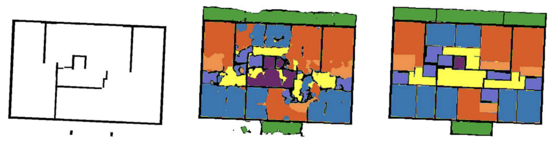

# Project Name: Floor Plan Generation
## Introduction

Designing a functional and visually appealing floor plan is a crucial aspect of the architectural process. This plan serves as a blueprint, outlining the spatial relationships, room types, and dimensions within a given structure. Traditionally, the development of a floor plan has been an iterative, trial-and-error endeavor, requiring extensive collaboration between interior designers, architects, and homeowners.

The process of creating a floor plan is often time-consuming and demands a significant level of expertise and experience from the design team. Interior designers must carefully consider factors such as room connectivity, traffic flow, furniture placement, and the overall aesthetic of the space. Homeowners, on the other hand, bring their unique preferences, lifestyle needs, and spatial requirements to the table, further complicating the design process.

To address the challenges inherent in manual floor plan design, the field of architecture has seen the emergence of automatic floor plan generation using AI. This innovative technique leverages advanced algorithms and computational tools to streamline the design process, allowing for the rapid generation of multiple floor plan options that can be refined and optimized based on the specific requirements of the project.

By automating the floor plan design process, architects and interior designers can explore a wider range of possibilities, experiment with different layouts, and quickly iterate on their designs. This not only saves time and resources but also enables the creation of more efficient, user-centric spaces that better meet the needs of the homeowners or occupants.

In this code project, I aimed to use encoder-decoder structure to generate floor plans. The dataset used is the [ICCV23 Challenge](https://github.com/cvaad-workshop/iccv23-challenge/tree/main), which was a competition aimed to generate a complete floor plan configuration based on a building's necessary structural elements, and a set of user-defined constraints organized in a graph structure. 

The architecture was inspired by [Skip-Connected Neural Networks for Floor Plan Auto-Generation](https://arxiv.org/pdf/2309.13881). I did not use skip connections in my architecture, but the concept of using an encoder-decoder to generate floor plans and the feeding of the graph structure to a Graph Convolutional Network (GCN) which was then concatenated with the latent space of the encoder-decoder was used.

The only things used from the GitHub repository are the datasets and some of the plotting code and color mappings. The code is written from scratch through days of trial and error and internet research. 

## Table of Contents

- [Data](#Data)
- [Preprocessing](#preprocessing)
- [Model](#model)
- [Results](#results)
- [Installation](#installation)

## Data

As explained in the [ICCV23 Challenge](https://github.com/cvaad-workshop/iccv23-challenge/tree/main) repository, the input data consists of:

### Input Data
1) Required structural components as an image representation (folder: struct_in)

    i. Data format: .npy

    ii. Type: numpy array

    iii. Data type: .float16

    iv. Shape: [512, 512, 3]

    v. Info:

        1st channel: binary mask of structure (0 = structure, 1 = non-structure)
        2nd channel: x location
        3rd channel: y location


2) Required zoning access graph as a graph representation (folder: graph_in)

    i. Data format: .pickle

    ii. Type: networkx.Graph()

    iii. Nodes are area w/ attributes:

        zoning: classification of spatial "zone"

    iv. Edges are access connectivity w/ attributes:

        connectivity: classification of access type, e.g., "door", "entrance door", "passage"

### Output Data
1) Full floor plan as an image representation (folder: full_out)

    i. Data format: .npy

    ii. Type: numpy array

    iii. Data type: .float16

    iv. Shape: [512,512,3]

    v. Info:

        1st channel: multi-class segmentation mask (integer value corresponds to certain room-type)
        2nd channel: x location
        3rd channel: y location


2) Full room access graph as a graph representation (folder: graph_out)

    i. Data format: .pickle

    ii. Type: networkx.Graph()

    iii. Nodes are area w/ attributes:

        roomtype: classification of room-type

        centroid: centroid of the room (midpoint)

        geometry: shape of room as a polygon (shapely.geometry.Polygon())

    iv. Edges are access connectivity w/ attributes:

        connectivity: classification of access type, e.g., "door", "entrance door", "passage"

## Preprocessing

1) Empty Floor Plan

All preprocessing is done in the class preprocessDataset() in the file dataset_torch.py. The class is called in the training file, train.py. The class preprocesses the data in the following way:

Since I am using PyTorch, I transformed the empty floor plan (boundary image) and segmentation mask (labels) from the compelted floor plan into pytorch tensors. The segmentation mask, a crucial component of the dataset, is represented as a tensor of shape (1, 512, 512). This tensor basically encodes the label information for each pixel in the image, providing the necessary ground truth data for the model to learn from.

The classes for the complete floor plan are as follows:
```
"""
'Bedroom': 0,
'Livingroom': 1,
'Kitchen': 2,
'Dining': 3, 
'Corridor': 4,
'Stairs': 5,
'Storeroom': 6,
'Bathroom': 7,
'Balcony': 8,
'Structure': 9,
'Background': 13 -> 10
"""
```

The repository of the challenge states that they omitted three classes namely "Door", "Entrance Door", and "Window", hence I removed them from the classes and the 13th class which is the background is set to 10. Thus, we have 11 classes in total.

I mentioned that the X and Y locations of the image are given in the second and third channels of the image. I did not know how to utilize them as in my opinion, the image already represents the X and Y locations of the pixels. Hence, I did not use them. 

By carefully preprocessing the data in this manner, the preprocessDataset() class ensures that the input data is in the appropriate format for the PyTorch-based training pipeline. This streamlined approach to data preparation allows the model to focus on learning the essential patterns and relationships within the dataset.

2) Graph Structure

In the competition dataset, rooms are classified into each of the following zones:

```
'Zone1': ['Bedroom'],
'Zone2': ['Livingroom', 'Kitchen', 'Dining', 'Corridor'],
'Zone3': ['Stairs', 'Storeroom', 'Bathroom'],
'Zone4': ['Balcony'],
```

These zonings are found in the node attributes of the graph as follows:

```
NodeDataView({0: {'zoning_type': 1}, 1: {'zoning_type': 2}, 2: {'zoning_type': 1}, 3: {'zoning_type': 1} ...})
```

Here, node 0 has a zoning type of 1 which corresponds to 'Zone1' in the dictionary above. Since Zone1 has only one room type, 'Bedroom', the zoning type 1 is deterministic of the room type 'Bedroom'. The same goes for Zone4. However, Zone2 and Zone3 have multiple room types. Hence, the zoning type is not deterministic of the room type.

So, the intuition was to create one-hot encoded tensor for each node in a graph creating the node features, which is then loaded into the x attribute of the PyG graph, which will be used as the input to the GCN.

There is another attribute for edges in the graph which is the connectivity type. However, I did not use this attribute in the model as I did not know how to use it in the model.

An example graph looks as follows:


## Model

1) Encoder-decoder
For the model, I used an encoder-decoder network to learn the data generating distribution of the floor plans. As they can learn a data generating distribution given an arbitrary build shape, and it will take a sample from our data generating distribution and produce a floor plan. 

The encoder component of the model is tasked with the critical responsibility of extracting meaningful features from the input boundary image. Through a series of convolutional layers, the encoder down-samples the input image while simultaneously amplifying its feature dimensionality. This approach enables the network to capture intricate patterns and semantics from the image at various scales, allowing it to develop an understanding of the spatial relationships and design elements present in the input.

However, it is important to note that as the spatial dimensions are reduced, the risk of losing granular details also increases. This is a common challenge in encoder-decoder architectures, where the encoder is tasked with compressing the input into a compact, low-dimensional representation. Techniques such as skip connections can help mitigate this, however, I do not have the experience and know-how to implement them yet.

Then, the decoder component of the model is responsible for reconstructing the input boundary image from the learned features. By leveraging a series of transposed convolutional layers, the decoder upsamples the feature representation, gradually restoring the spatial dimensions of the input image. This process allows the network to generate a detailed, high-resolution output that closely resembles the original input.

2) Graph Convolutional Network (GCN)
The GCN is used to learn the spatial relationships between the rooms in the floor plan. The GCN is a type of neural network that operates on graph-structured data, allowing it to model complex dependencies and interactions between nodes in a graph. In the context of floor plan generation, the GCN can be used to capture the connectivity and adjacency relationships between different rooms, enabling the model to generate floor plans that adhere to the specified zoning constraints.

The GCN takes as input the node features (one-hot encoded room types) and the edge indices of the graph, and applies a series of graph convolutional layers to propagate information between nodes.

The output of the GCN is then concatenated with the latent space of the encoder-decoder. As per my intuition, concatenating the output of the GCN to the latent space of the encoder works because the encoder already has the spatial information of the floor plan, hence having the correspondence that a pixel at a certain position will have a certain feature. Knowing that we have this correspondence, we can say that the output of the GCN will also correspond with the spatial information, e.g. a pixel at the top right of the image will have a certain feature from the encoder, which also contains the same feature output from the GCN. 

As discussed, the input of the model will be the empty floor plans 'struct_in' and their corresponding segmentation mask in 'full_out' which is fed into the encoder, whereas the graph structure 'graph_in' is inputted into the GCN. The output of the encoder is then concatenated with the output of the GCN which is fed into the decoder, this will hopefully preserve the latent space of the encoder and the spatial information of the floor plan, and the output of the GCN will be the spatial relationships of the rooms in the floor plan. In the end, we hope to have a completed floor plan as the output of the decoder.

Training the model was done using a separation of the data into training and validation sets. The model was trained on the training set and validated on the validation set, meaning that the model does not see the validation set during training. The validation set was used to evaluate the model's performance on unseen data, providing a reliable estimate of its generalization capabilities. For this, I used the loss function, CrossEntropyLoss, which is commonly used for multi-class classification problems, is used. The optimizer used is Adam.

We can use the validation set to evaluate the model's performance on unseen data. It is crucial that we do not update the model's parameters during this phase, so there is no need to update the gradients. This is done by using torch.no_grad(), which temporarily disables gradient computation. The model is then evaluated on the validation set, and the loss is calculated. This loss value provides a measure of how well the model is performing on the validation data, allowing us to assess its generalization capabilities.
The model was trained for 70 epochs with a batch size of 8.

We set an input channel of 3 for the model as the empty floor plan has 3 channels, and an output channel of 11 as there are 11 room types in the dataset.

## Results

### Sanity Check
Conducting a sanity check by predicting on one of the training images is a common practice to ensure the model is functioning as expected. While this does not provide a comprehensive evaluation of the model's performance, it serves as a basic check to verify that the model is able to generate predictions, even if the results may not be indicative of the model's overall effectiveness. This initial step helps establish a baseline understanding of the model's capabilities before conducting more thorough testing and evaluation. For the plot, the backbone of the plotting code and the color mapping for each room type used follows the github repository. 

The floor plan generated by the model is shown below:


We see that the model has generated a floor plan that closely resembles the ground truth image. 
Every room is colored and the pixels outside the boundary are never colored. We also see the labels of the rooms using colors have nearly the same colors as the ground truth image. The model has successfully learned to generate a complete floor plan based on the structural components of the building and the graph structure. This demonstrates the model's ability to capture the spatial relationships, allowing it to segment the rooms and label them accordingly while also adhering to the zoning constraints specified in the graph structure.

It is not perfect as there is some noise in the rooms and some of the wall structures are not predicted well. However, this is a good start.

### Predicting without the Graph Structure

Ablasion is a common technique used to evaluate the importance of different components of a model. By removing certain components and observing the impact on the model's performance, we can gain insights into the model's behavior and identify areas for improvement.

In this case, we can evaluate the model's performance by removing the graph structure input and observing the impact on the generated floor plans. By training the model without the graph structure and comparing the results to the model trained with the graph structure, we can assess the importance of the graph structure in generating accurate floor plans. 

The floor plan generated by the model without the graph structure is shown below:


As expected, we see no zoning constraints of the rooms in the floor plan. Without the graph structure, the model has no way of knowing and does not consider the relationships and connections between the rooms, resulting in a floor plan that is cloudy and unstructured. This highlights the importance of the graph structure in guiding the model's prediction. 

### Predicting with the Graph Structure

The validation loss of the model can be seen in the following plot:


The plot shows that the validation loss decreases over time, indicating that the model is learning and improving its performance on the validation set. The loss curve is relatively smooth, suggesting that the model is converging towards an optimal solution. The validation loss is a useful metric for evaluating the model's performance and tracking its progress during training.

The floor plans generated by the model with the graph structure is shown below:


With the graph structures, we see that there is less noise and clearer structure of the rooms in the floor plan. Although there are still some noise clouds, this is reduced by the zoning constraints in the graph structure which tells the model the connections a room should have with other rooms. This demonstrates the importance of the graph structure in guiding the model's prediction and ensuring that the generated floor plan adheres to the specified zoning constraints.

One interesting thing to note based on my observation is that the zoning types which are deterministic e.g. Zone1 and Zone4 which are 'Bedroom' and 'Balcony' respectively, have no lesser label misclassifications in their areas than the other zones. Because the model knows that Zone1 and Zone4 always belong to one room, the model does not confuse it with other rooms. Whereas, Zone2 and Zone3 have multiple room types, hence the model has a higher chance of misclassifying the rooms to other types in these zones.

As expected, this vanilla model does not perform better than the one proposed in the paper which uses skip-connections, which ensures information flow across layers, resulting in lost spatial details to be preserved, and probably some specific hyperparameters or weights. The prediction from the paper is shown below and is evidently better than the one I implemented.



Overall, this is a good starting point for floor plan generation using encoder-decoders and GCNs. Improvements can be made by incorporating skip connections or attention layers, experimenting with different hyperparameters, increasing the number of epochs, and exploring more advanced architectures to enhance the model's performance. 

Through this project, I have learned first-hand how to use encoder-decoders and even incorporating graph features to the encoder-decoders, which are things I have never done before. I have gained valuable insights into the process of floor plan generation using AI, and I look forward to further exploring this fascinating field in the future.

## Installation

### Dataset
The dataset and the model can be downloaded here:

https://drive.google.com/file/d/1UqKapeovTkS1WU9_LdgVxbsGirxj_cwY/view?usp=sharing

https://drive.google.com/file/d/1UTSgaLoumsyL9SWQBeioCRZGB5UGSLZx/view?usp=sharing 

Then put both of the folders in the root directory of the project.

### Environment
Create a Conda environment:
```bash
conda create -n industrialenv python==3.9.0
conda activate industrialenv
conda install pytorch==2.0.0 torchvision==0.15.0 torchaudio==2.0.0 pytorch-cuda=11.8 -c pytorch -c nvidia
pip install -r requirements.txt
```

### Training
Run the following command for training:
```bash
python train.py
```

### Visualization
Run the inference_visualization.ipynb Jupyter Notebook for visualization.